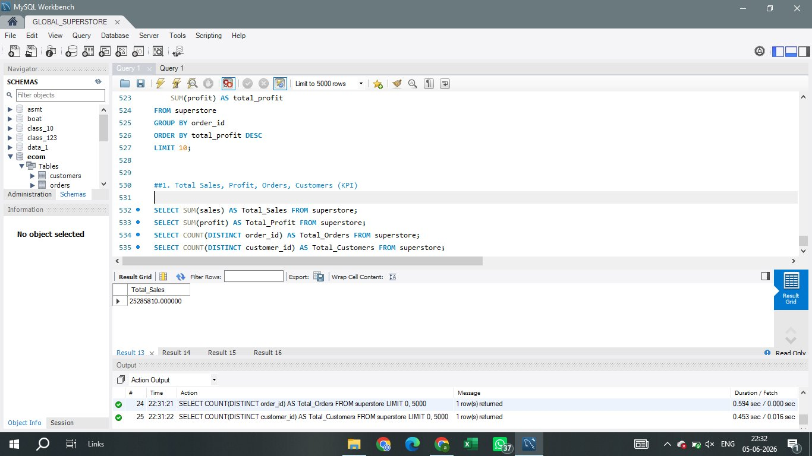
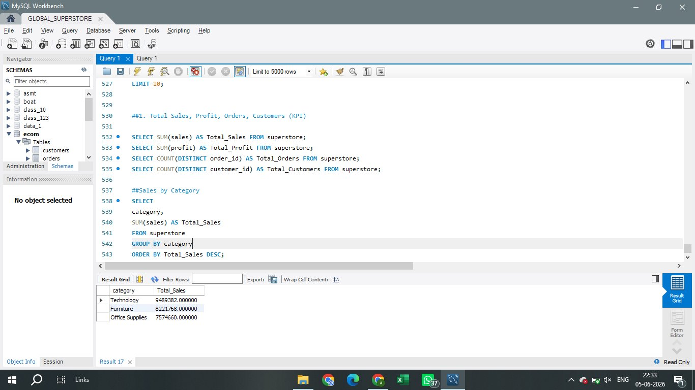
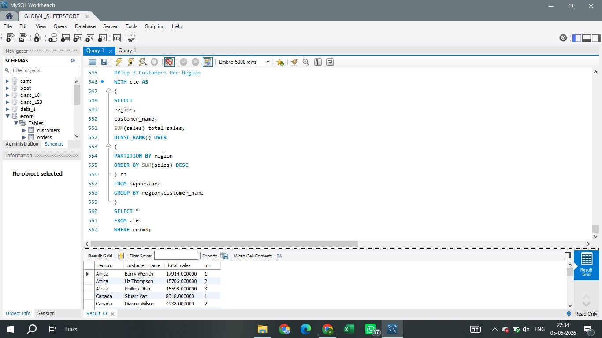
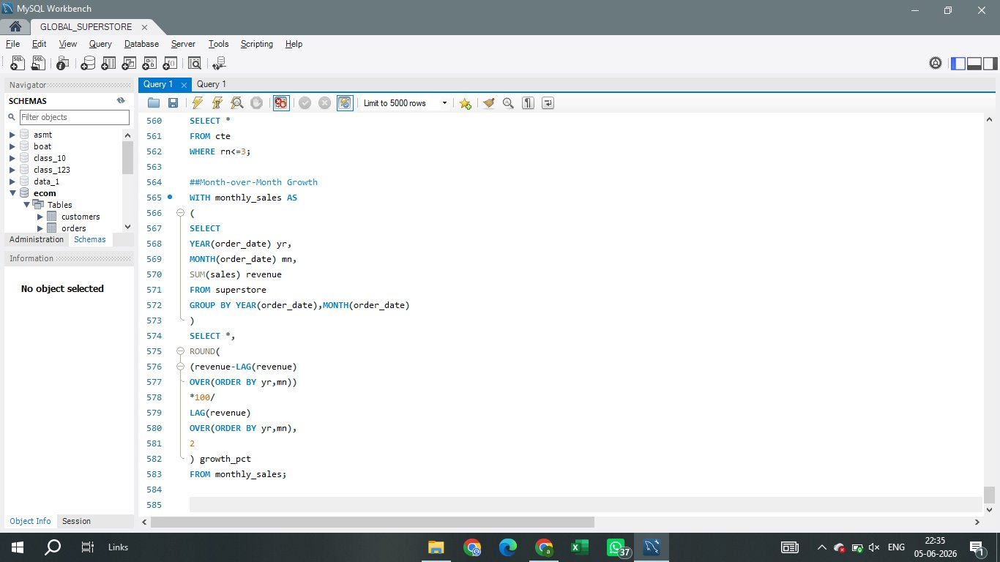

# 🛒 Global Superstore Sales & Profit Analysis


## 📌 Project Overview

An end-to-end **Data Analytics project** on Global Superstore dataset with **51,290 records** across 27 columns. This project covers data cleaning, SQL analysis, and an interactive Power BI dashboard to uncover key business insights around Sales, Profit, Customers, and Regional Performance.

---

## 📊 Power BI Dashboard

### Page 1 — Executive Dashboard


### Page 2 — Customer & Product Analysis


### Page 3 — Regional & Operational Insights


---

## 🗂️ Project Structure

```
superstore-sales-analysis/
│
├── README.md
├── analysis.sql               ← All SQL queries
├── page1_executive.png        ← Dashboard screenshot
├── page2_customer.png         ← Dashboard screenshot
├── page3_regional.png         ← Dashboard screenshot
├── KPI_RESULTS.png            ← SQL output
├── SALE_BY_CATEGORY.png       ← SQL output
├── top_customers_region.png   ← SQL output
├── MOM_GROWTH.png             ← SQL output
└── pp.pbix                    ← Power BI dashboard file
```

---

## 🔧 Tools Used

| Tool | Purpose |
|------|---------|
| MySQL Workbench | Data storage & SQL analysis |
| Power BI Desktop | Interactive dashboard |
| Python | Data cleaning & encoding fix |

---

## 📈 Key Insights

- 💰 **Total Sales:** ~$25 Million across all markets
- 📦 **Total Orders:** 25,000+
- 👥 **Total Customers:** 5,000+
- 📊 **Profit Margin:** 11.61%
- 🏆 **Top Category:** Technology leads in both Sales & Profit
- 🌍 **Top Region:** Central region has highest sales
- 🚢 **Most Used Shipping:** Standard Class (62%)
- 📱 **Top Product:** Apple Smart Phone drives highest revenue
- ⚠️ **Loss Alert:** Furniture category has lowest profit margin

---

## 🧠 SQL Queries Used

### 1. KPI Results — Total Sales, Profit, Orders, Customers


```sql
SELECT SUM(sales) AS Total_Sales FROM superstore;
SELECT SUM(profit) AS Total_Profit FROM superstore;
SELECT COUNT(DISTINCT order_id) AS Total_Orders FROM superstore;
SELECT COUNT(DISTINCT customer_id) AS Total_Customers FROM superstore;
```

---

### 2. Sales by Category


```sql
SELECT category,
    SUM(sales) AS Total_Sales
FROM superstore
GROUP BY category
ORDER BY Total_Sales DESC;
```

---

### 3. Top 3 Customers Per Region (Window Function)


```sql
WITH cte AS (
    SELECT region, customer_name,
        SUM(sales) total_sales,
        DENSE_RANK() OVER (
            PARTITION BY region
            ORDER BY SUM(sales) DESC
        ) rn
    FROM superstore
    GROUP BY region, customer_name
)
SELECT * FROM cte WHERE rn <= 3;
```

---

### 4. Month-over-Month Growth (LAG Function)


```sql
WITH monthly_sales AS (
    SELECT YEAR(order_date) yr,
        MONTH(order_date) mn,
        SUM(sales) revenue
    FROM superstore
    GROUP BY YEAR(order_date), MONTH(order_date)
)
SELECT *,
    ROUND(
        (revenue - LAG(revenue) OVER(ORDER BY yr,mn)) * 100 /
        LAG(revenue) OVER(ORDER BY yr,mn), 2
    ) growth_pct
FROM monthly_sales;
```

---

## 🚀 How to Run

1. **Clone this repository**
```bash
git clone https://github.com/abhishekrocks9756-ops/superstore-sales-analysis
```

2. **Import data to MySQL**
```sql
CREATE DATABASE ecom;
USE ecom;
-- Run CREATE TABLE from analysis.sql
-- Then LOAD DATA INFILE with superstore_fixed.csv
```

3. **Open Power BI Dashboard**
   - Open `pp.pbix` in Power BI Desktop
   - Refresh data connection if needed

---

## 👨‍💻 Author

**Abhishek Verma**  
📍 Noida, India  
🔗 [GitHub](https://github.com/abhishekrocks9756-ops)

---

⭐ **If you found this project helpful, please give it a star!**
