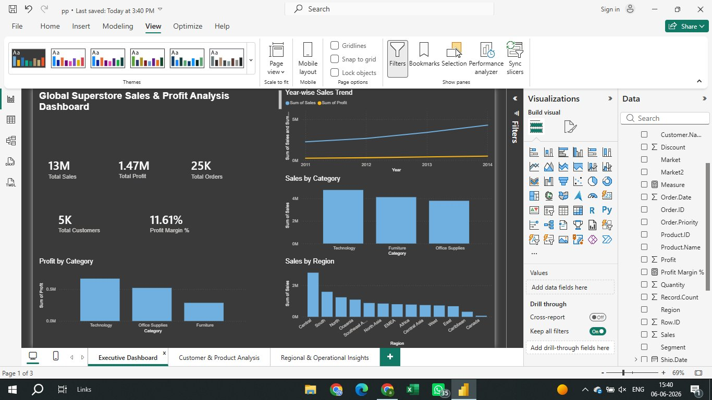
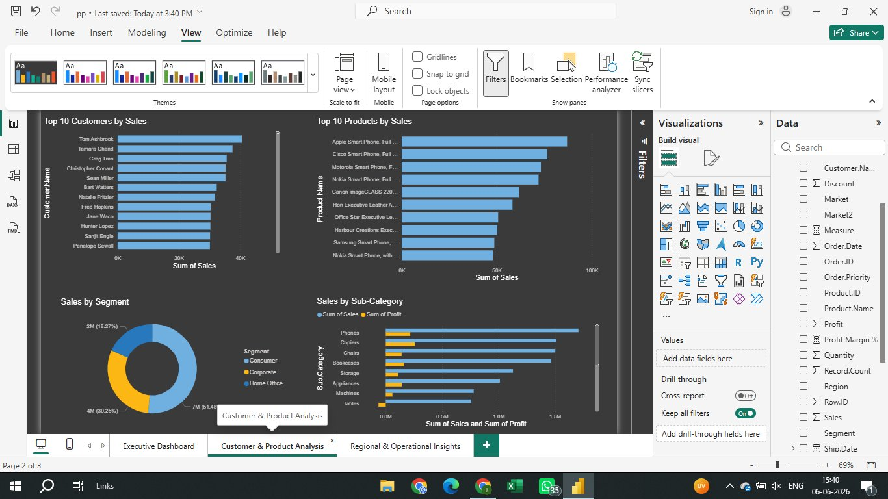
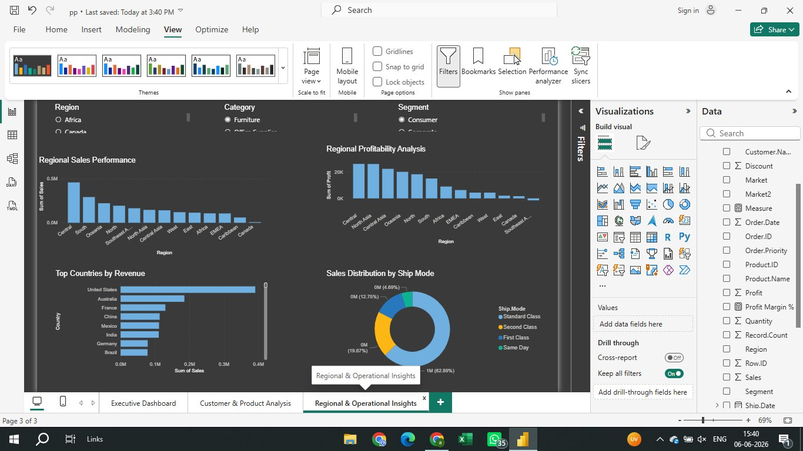

# 🛒 Global Superstore Sales & Profit Analysis


## 📌 Project Overview

An end-to-end **Data Analytics project** on Global Superstore dataset with **51,290 records** across 27 columns. This project covers data cleaning, SQL analysis, and an interactive Power BI dashboard to uncover key business insights around Sales, Profit, Customers, and Regional Performance.

---

## 📊 Dashboard Preview

### Page 1 — Executive Dashboard


### Page 2 — Customer & Product Analysis


### Page 3 — Regional & Operational Insights


---

## 🗂️ Project Structure

```
superstore-sales-analysis/
│
├── README.md
├── analysis.sql              ← All SQL queries
├── page1_executive.png       ← Dashboard screenshot
├── page2_customer.png        ← Dashboard screenshot
├── page3_regional.png        ← Dashboard screenshot
└── pp.pbix                   ← Power BI dashboard file
```

---

## 🔧 Tools Used

| Tool | Purpose |
|------|---------|
| MySQL Workbench | Data storage & SQL analysis |
| Power BI Desktop | Interactive dashboard |
| Python | Data cleaning & encoding fix |

---

## 📈 Key Insights

- 💰 **Total Sales:** ~$13 Million across all markets
- 📦 **Total Orders:** 25,000+
- 👥 **Total Customers:** 5,000+
- 📊 **Profit Margin:** 11.61%
- 🏆 **Top Category:** Technology leads in both Sales & Profit
- 🌍 **Top Region:** Central region has highest sales
- 🚢 **Most Used Shipping:** Standard Class (62%)
- 📱 **Top Product:** Apple Smart Phone drives highest revenue
- ⚠️ **Loss Alert:** Furniture category has lowest profit margin

---

## 📋 SQL Analysis Highlights

```sql
-- Total Business Overview
SELECT 
    COUNT(*) AS Total_Orders,
    ROUND(SUM(Sales), 2) AS Total_Sales,
    ROUND(SUM(Profit), 2) AS Total_Profit,
    ROUND((SUM(Profit)/SUM(Sales))*100, 2) AS Profit_Margin_Pct
FROM superstore;

-- Category wise Sales & Profit
SELECT 
    Category,
    ROUND(SUM(Sales), 2) AS Total_Sales,
    ROUND(SUM(Profit), 2) AS Total_Profit,
    COUNT(*) AS Total_Orders
FROM superstore
GROUP BY Category
ORDER BY Total_Sales DESC;

-- Top 10 Most Profitable Products
SELECT Product_Name, 
    ROUND(SUM(Sales), 2) AS Total_Sales,
    ROUND(SUM(Profit), 2) AS Total_Profit
FROM superstore
GROUP BY Product_Name
ORDER BY Total_Profit DESC
LIMIT 10;

-- Year-wise Sales Trend
SELECT Year, 
    ROUND(SUM(Sales), 2) AS Total_Sales,
    ROUND(SUM(Profit), 2) AS Total_Profit
FROM superstore
GROUP BY Year
ORDER BY Year;

-- Top 10 Customers
SELECT Customer_Name,
    COUNT(*) AS Total_Orders,
    ROUND(SUM(Sales), 2) AS Total_Sales
FROM superstore
GROUP BY Customer_Name
ORDER BY Total_Sales DESC
LIMIT 10;

-- Region wise Performance
SELECT Region,
    ROUND(SUM(Sales), 2) AS Total_Sales,
    ROUND(SUM(Profit), 2) AS Total_Profit
FROM superstore
GROUP BY Region
ORDER BY Total_Sales DESC;
```

---

## 🚀 How to Run

1. **Clone this repository**
```bash
git clone https://github.com/abhishekrocks9756-ops/superstore-sales-analysis
```

2. **Import data to MySQL**
```sql
CREATE DATABASE ecom;
USE ecom;
-- Run CREATE TABLE from analysis.sql
-- Then LOAD DATA INFILE with superstore_fixed.csv
```

3. **Open Power BI Dashboard**
   - Open `pp.pbix` in Power BI Desktop
   - Refresh data connection if needed

---

## 👨‍💻 Author

**Abhishek Verma**  
📍 Noida, India  
🔗 [GitHub](https://github.com/abhishekrocks9756-ops)

---

⭐ **If you found this project helpful, please give it a star!**
